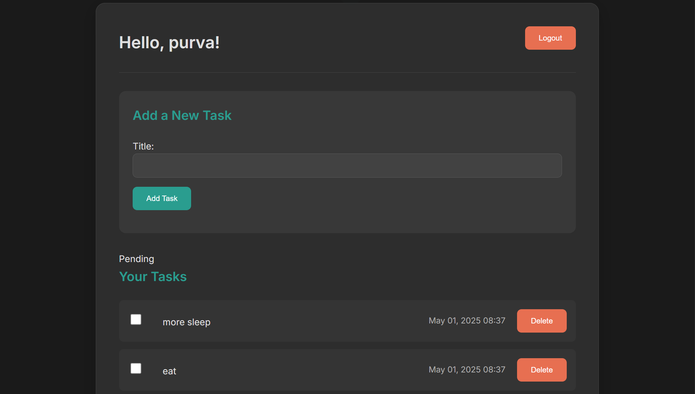

```markdown
# TaskFlow

> A sleek, dark-themed todo-list web application with user authentication, built on Django.

---



---

## 🚀 Features

- **User Authentication**  
  Signup, login, logout flows with secure password hashing.
- **Task Management**  
  Create, read, update, and delete tasks.
- **Completion Tracking**  
  Mark tasks complete/incomplete with a single click.
- **Responsive Dark Theme**  
  Modern, mobile-friendly interface using CSS custom properties.
- **Error Handling & Validation**  
  Inline form errors and helpful validation messages.
- **Clean Codebase**  
  Django-style project/app separation, modular templates, and SCSS-friendly CSS.

---

## 🛠 Technologies

- **Backend**: Django 5.0  
- **Frontend**: HTML5, CSS3 (with [Inter](https://fonts.google.com/specimen/Inter) font)  
- **Database**: SQLite (default; easy local setup)  
- **Authentication**: Django’s built-in auth system  
- **Styles**: CSS custom properties for theming  

---

## 📥 Installation

1. **Clone the repo**  
   ```bash
   git clone https://github.com/your-username/taskflow-django.git
   cd taskflow-django
   ```
2. **Create & activate a virtual environment**  
   ```bash
   python -m venv venv
   source venv/bin/activate    # macOS/Linux
   venv\Scripts\activate       # Windows
   ```
3. **Install dependencies**  
   ```bash
   pip install -r requirements.txt
   ```
4. **Apply migrations**  
   ```bash
   python manage.py migrate
   ```
5. **Create a superuser (optional)**  
   ```bash
   python manage.py createsuperuser
   ```
6. **Run the development server**  
   ```bash
   python manage.py runserver
   ```
7. **Open in browser**  
   Navigate to `http://127.0.0.1:8000/` to explore TaskFlow.

---

## ⚙️ Configuration

- **Static & Media**  
  - Make sure `STATIC_URL` and `STATICFILES_DIRS` point to `static/` in `settings.py`.
  - For production, configure `STATIC_ROOT` and run `collectstatic`.
- **Database**  
  - Default: SQLite (`db.sqlite3`).
  - To use PostgreSQL/MySQL: update `DATABASES` in `settings.py`.
- **Email (Optional Password Reset)**  
  ```python
  EMAIL_BACKEND = 'django.core.mail.backends.smtp.EmailBackend'
  EMAIL_HOST = 'smtp.example.com'
  EMAIL_PORT = 587
  EMAIL_HOST_USER = 'you@example.com'
  EMAIL_HOST_PASSWORD = 'yourpassword'
  EMAIL_USE_TLS = True
  ```

---

## 📂 Project Structure

```
taskflow-django/
├── manage.py
├── requirements.txt
├── README.md
├── db.sqlite3
├── screenshots/
│   └── dashboard.png
├── static/
│   ├── css/
│   │   └── style.css
│   └── fonts/
├── templates/
│   ├── registration/
│   │   ├── login.html
│   │   └── signup.html
│   ├── dashboard.html
│   └── base.html
├── todoproject/
│   ├── settings.py
│   ├── urls.py
│   └── wsgi.py
└── todo/
    ├── migrations/
    ├── models.py
    ├── views.py
    ├── forms.py
    ├── urls.py
    └── templates/
```

---

## 🤝 Contributing

1. Fork the repository  
2. Create a feature branch (`git checkout -b feature/YourFeature`)  
3. Commit your changes (`git commit -m "Add YourFeature"`)  
4. Push to the branch (`git push origin feature/YourFeature`)  
5. Open a Pull Request  

Please follow the existing code style and include tests where applicable.

---

## 📝 License

This project is licensed under the MIT License.  
See [LICENSE](LICENSE) for details.

---

## 🙏 Acknowledgments

- Inspired by Django’s official tutorial and modern dark-mode design trends.  
- Thanks to the open-source community for libraries and tools that make this possible!  
```